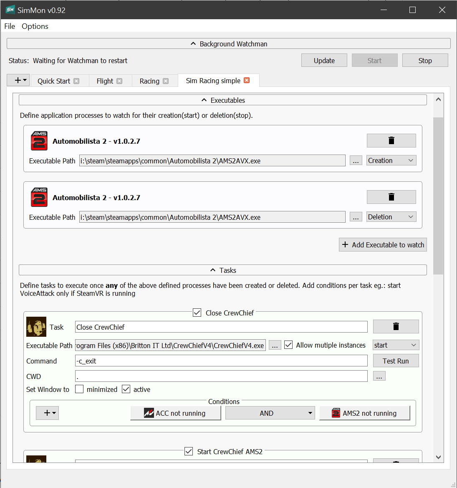

# SimMon
### Sim Application profiler

M$ Windows application profiler running in the background to tame Simulation gaming needs for racing or flight
sims. Start any follow up application when the start of your Sim application is detected.

    

#### Usage
- Download the <a href="https://github.com/tappi287/simmon_gui/releases">latest installer</a>
- Start the app
- Choose Options>Install Watchman as Windows logon task
- Configure your profiles
- Enjoy your Sim
    
#### SimMon Gui
Create profiles of what applications to start or cmd's to execute once the start of your Sim was detected.
Followup chain detection of other running processes for different tasks:
- "myawesomesim.exe" started
    - Steam-VR running -> start CrewChief and SimHub to drive
    - OBS running -> start fancy streaming app

Auto detection of some common Sim Games by their registry keys.

#### SimMon Watcher
Part of this application is the Background Watcher. Low profile background app/Windows Service that watches for process creation/termination. Fulfil profile tasks
created by the GUI.

Controllable from within the GUI. No need to keep the GUI running. Just close it.
The watcher will relentlessly run in the background.
